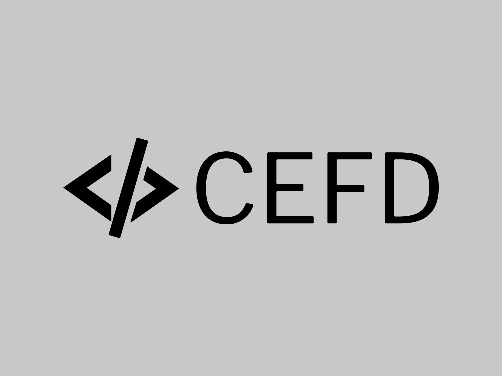

<div align='center'>


<hr>

### **✨ Your Personal Compression App ✨**


[](https://github.com/namansharma18899/cefd/blob/main/LICENSE)
[](https://github.com/namansharma18899/cefd/network)
[](https://github.com/namansharma18899/cefd/issues)
[](https://github.com/namansharma18899/cefd/commits/main)

*If you like my work a ⭐ would mean the world*
</div>

---

## 🌎 Overview
The cefd (Compression Engine For Dummies) is a simple Compression app which encodes text. It's USP is that it's easy to use/understand for someone whose new to Compression.
Also Good place for someone to learn compression algos.

## 🫧 Features
- **Beginner Friendly Compression Algo**: Let's Type brings typing speed evaluation right to your terminal, creating a seamless and distraction-free environment for users.

- **Python Power**: Developed entirely in Python, Let's Type is not just a typing speed calculator; it's a testament to the versatility and elegance of Python programming.

- **See the effect**: You can design your own algo, use it in the app and compare it with the market standards.

## 🤨 Why
- Inspired by Zip : )

## ⚙️ Setup
```bash
$ cd cefd/
$ export PYTHONPATH=`pwd`
$ python3 -m unittest discover -s tests/compression -v
```

## 🤗 Support
- Make sure to leave a ⭐ if you like this project.

## 📖 Bibliography
- Learn more about [bwt-rle-compression](https://www.baeldung.com/cs/bwt-rle-compression-algorithm-for-short-text-strings).
